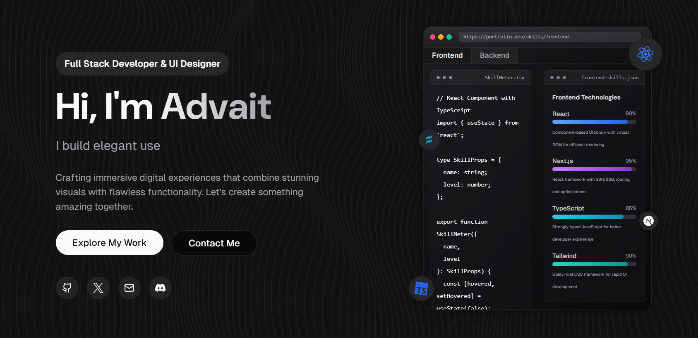

# Portfolio Website

<div align="center">
  
  
  [](https://opensource.org/licenses/MIT)
  [](http://makeapullrequest.com)
  [](https://nextjs.org/)
  [](https://reactjs.org/)
  [](https://www.typescriptlang.org/)
  [](https://tailwindcss.com/)
</div>

## 🚀 Live Demo

[View Live Demo](https://advaitt.tech)


## ✨ Features

- 🎨 Modern and responsive UI design
- 🌙 Dark/Light mode support
- ⚡ Fast and optimized performance
- 📱 Mobile-first approach
- 🔒 Secure authentication
- 🎯 Type-safe with TypeScript
- 🎭 Smooth animations and transitions
- 📊 Interactive data visualization
- 🔍 SEO optimized
- 🌐 Internationalization support

## 🛠️ Tech Stack

- **Framework:** [Next.js](https://nextjs.org/)
- **Language:** [TypeScript](https://www.typescriptlang.org/)
- **Styling:** [TailwindCSS](https://tailwindcss.com/)
- **UI Components:** [shadcn/ui](https://ui.shadcn.com/)
- **Animations:** [Framer Motion](https://www.framer.com/motion/)
- **State Management:** [Zustand](https://zustand-demo.pmnd.rs/)
- **Form Handling:** [React Hook Form](https://react-hook-form.com/)
- **Validation:** [Zod](https://zod.dev/)
- **API Client:** [TanStack Query](https://tanstack.com/query/latest)
- **Testing:** [Vitest](https://vitest.dev/) + [Testing Library](https://testing-library.com/)

## 📦 Installation

1. Clone the repository:
```bash
git clone https://github.com/yourusername/your-project.git
cd your-project
```

2. Install dependencies:
```bash
npm install
# or
yarn install
# or
pnpm install
```

3. Set up environment variables:
```bash
cp .env.example .env.local
```

4. Start the development server:
```bash
npm run dev
# or
yarn dev
# or
pnpm dev
```

5. Open [http://localhost:3000](http://localhost:3000) in your browser.

## 🏗️ Project Structure

```
├── app/                 # Next.js 13 app directory
│   ├── api/            # API routes
│   ├── (routes)/       # Page routes
│   └── layout.tsx      # Root layout
├── components/         # React components
│   ├── ui/            # UI components
│   └── layout/        # Layout components
├── lib/               # Utility functions
├── public/            # Static assets
├── styles/            # Global styles
└── types/             # TypeScript types
```

## 🎯 Key Features in Detail

### 1. Modern UI/UX
- Responsive design that works on all devices
- Smooth animations and transitions
- Dark/Light mode support
- Accessible components

### 2. Performance
- Optimized images and assets
- Code splitting and lazy loading
- Server-side rendering where needed
- Efficient state management

### 3. Developer Experience
- TypeScript for type safety
- ESLint and Prettier for code quality
- Husky for git hooks
- Comprehensive documentation

## 🤝 Contributing

1. Fork the repository
2. Create your feature branch (`git checkout -b feature/amazing-feature`)
3. Commit your changes (`git commit -m 'Add some amazing feature'`)
4. Push to the branch (`git push origin feature/amazing-feature`)
5. Open a Pull Request

## 📝 License

This project is licensed under the MIT License - see the [LICENSE](LICENSE) file for details.


## 🙏 Acknowledgments

- [Next.js](https://nextjs.org/)
- [TailwindCSS](https://tailwindcss.com/)
- [shadcn/ui](https://ui.shadcn.com/)
- [Framer Motion](https://www.framer.com/motion/)
- And all other amazing open-source projects that made this possible!

## 📞 Contact

- Website: [advaitt.tech](https://advaitt.tech)
- Email: advaitt.dev@gmail.com

